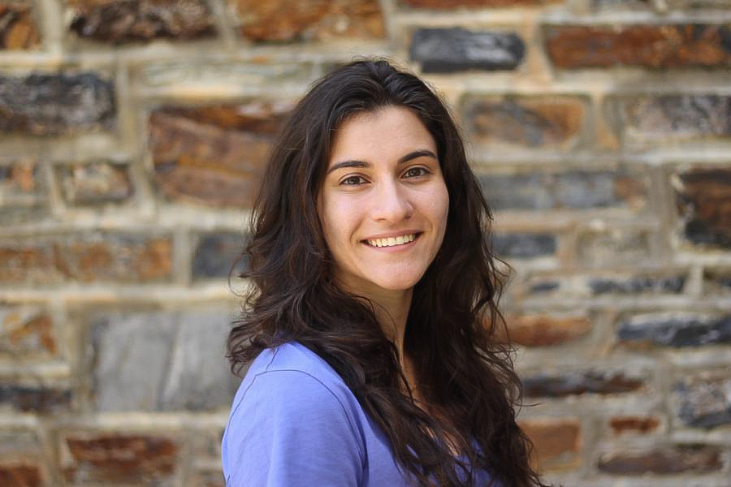

## Hey! Thanks for stopping by

My name is Isabelle Rathbun. I'm a PhD student in Computer Science at the University of Maryland, College Park, as well as a 2024 NDSEG fellow. I am co-advised by [Dr. Chris Metzler](https://www.cs.umd.edu/people/metzler) and [Dr. Bill Regli](https://isr.umd.edu/clark/faculty/902/William-Regli). My current research focuses on Generative AI and increasing the robustness of multimodal, multi-sensor systems. I completed my undergrad in 2023 at the University of Maryland, Baltimore County, where I studied Computer Science, Math, and Biology. I am passionate about using computer science to improve the systems we interact with in our daily lives and using the power of generative AI to learn more about the things around us. Additionally, the intersection of medicine and AI is a long-term interest of mine. 

Outside of academia, I enjoy exploring DC's coolest food spots, travelling, listening to music, skateboarding, trying new things, and spending time with my friends. Check out my [Shennanigans](https://irathb8949.github.io/shennanigans/) blog to see more about what I've been up to recently! I also have two younger brothers who I enjoy hanging out with.
